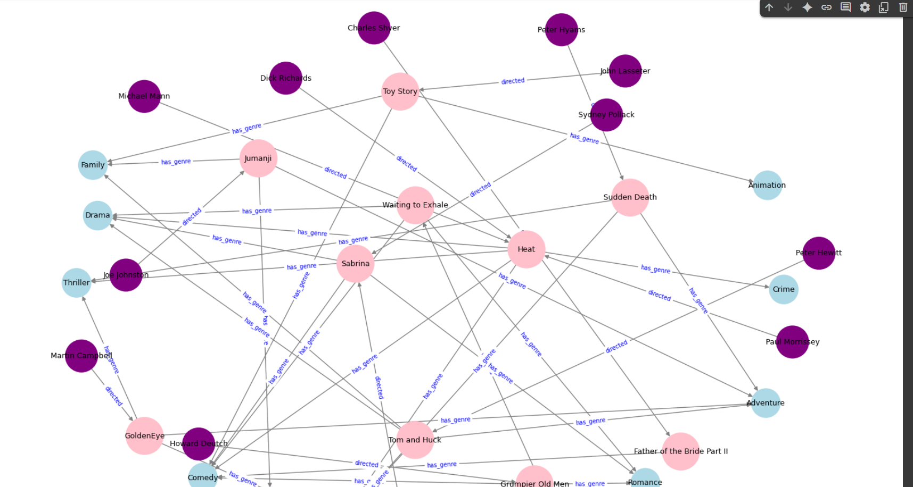

# 🎬 Movie Knowledge Graph

This project builds and visualizes a **Knowledge Graph** of movies, directors, and genres using the Kaggle Movies Dataset, processed in Python with `pandas` and visualized with `networkx`.

The project was developed and tested on **Google Colab**.

---

## 📊 Dataset

We use the following files from [The Movies Dataset on Kaggle](https://www.kaggle.com/datasets/rounakbanik/the-movies-dataset):

- `movies_metadata.csv`
- `credits.csv`

These files include metadata about movies, including:
- Movie titles
- Genres
- Directors (from crew information)

---

## 🛠️ Features

✅ Parses genres and directors from the dataset  
✅ Builds triples:  
- *Movie → has_genre → Genre*
- *Director → directed → Movie*  

✅ Filters a small sample of movies with directors for better visualization  
✅ Builds a **directed knowledge graph**  
✅ Visualizes the graph with nodes colored by type:  
- Movies (pink)
- Directors (purple)
- Genres (blue)

---

## 📂 Project Structure
📁 Movie_Knowledge_Graph/
├── credits.csv
├── Example.png
├── Movie_Knowledge_Graph.ipynb
├── movies_metadata.csv
├── README.md

---

## 🚀 How to Run

1️⃣ Download the two CSV files from Kaggle and save them to your computer.

2️⃣ Open [Google Colab](https://colab.research.google.com/) and upload:
- `movies_metadata.csv`
- `credits.csv`

3️⃣ Upload and run the `Movie_Knowledge_Graph.ipynb` file in Colab.

4️⃣ The notebook will:
- Process and clean the data
- Build the graph
- Visualize it as a plot

---

## 🖼️ Example Output

You’ll get a graph like this:  
- pink nodes: movies
- purple nodes: directors
- Blue nodes: genres  
Edges show the relationships (`has_genre`, `directed`).

---

## 📚 Requirements

- Google Colab (recommended) or Python 3.x
- Python packages:
- pandas
- matplotlib
- networkx

All packages are already available in Colab!

---

## 🤝 Contributing

Pull requests are welcome!  
Feel free to open an issue if you have ideas, questions, or improvements.

---

## 📜 License

This project is open-source and free to use under the [MIT License](LICENSE).

---

⭐ If you like it, please give the repo a ⭐ on GitHub!